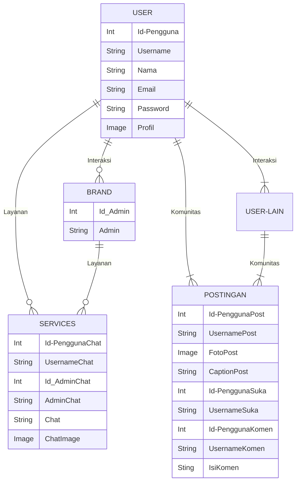
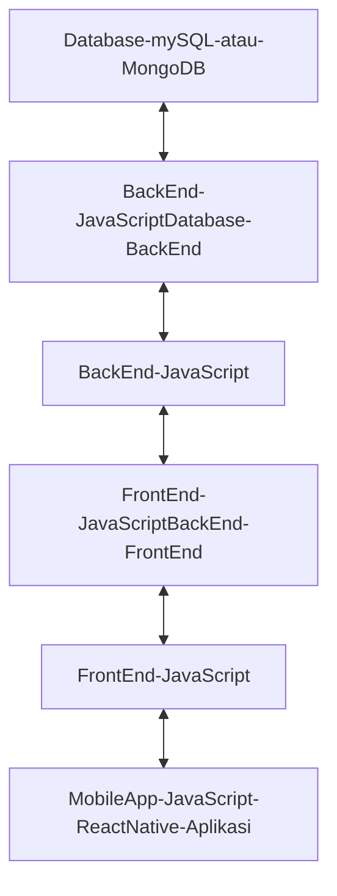

# SEVSPO 

## 1.1 Latar Belakang

Sevspo Indonesia, sebuah perusahaan UMKM yang memfokuskan diri pada produksi sepatu olahraga, khususnya untuk futsal dan sepak bola, serta turut menyediakan sepatu running dan sendal. Meskipun Sevspo hanya berukuran kecil, perusahaan ini tengah mempertimbangkan langkah-langkah untuk meningkatkan kualitas pelayanannya kepada pelanggan dan mitra bisnis, sejalan dengan perkembangan teknologi dan tuntutan pasar yang semakin digital.

Perkembangan industri e-commerce dan digitalisasi menjadi faktor penting dalam keputusan Sevspo untuk merancang aplikasi khusus, mengakui bahwa tren ini telah mengubah perilaku konsumen modern yang cenderung beralih ke transaksi online. Dengan meluncurkan aplikasi SEVSPO, perusahaan berharap dapat memberikan kemudahan bagi pelanggan dalam menjelajahi dan melakukan pembelian produk Sevspo, menciptakan pengalaman belanja yang lebih nyaman dan efisien.

Dalam menghadapi persaingan yang semakin ketat di pasar sepatu olahraga, Sevspo melihat aplikasi ini sebagai langkah strategis untuk memberikan nilai tambah kepada pelanggan. Selain sebagai wadah transaksi, aplikasi ini juga diharapkan dapat menjadi alat untuk memperkuat hubungan antara perusahaan, pelanggan, dan mitra bisnis. Fitur-fitur seperti pelacakan pesanan, notifikasi promo, dan layanan pelanggan interaktif menjadi bagian integral dari upaya perusahaan untuk meningkatkan kepuasan pelanggan.

Selain itu, pengembangan aplikasi SEVSPO tidak hanya terbatas pada aspek transaksional semata. Perusahaan ingin menggunakan aplikasi ini sebagai medium untuk membangun komunitas di sekitar mereknya. Berbagai kegiatan komunitas, seperti diskusi olahraga, kontes, atau event-event khusus, dapat diintegrasikan dalam aplikasi ini. Melalui pendekatan ini, Sevspo berharap dapat membangun loyalitas pelanggan dan meningkatkan interaksi positif di antara komunitas pengguna.

Optimasi rantai pasok dan manajemen persediaan juga menjadi fokus dalam pengembangan aplikasi ini. Dengan mendapatkan data yang lebih akurat dari transaksi online, Sevspo berharap dapat meningkatkan efisiensi operasional, mengidentifikasi tren penjualan, dan memproyeksikan kebutuhan persediaan dengan lebih baik.

(Saat ini saya bekerja sebagai editor di Sevspo dan akan mencoba ke bidang lain sesuai pendidikan yang saya jalani seperti saat ini belajar membuat projek aplikasi brand).

Saat ini, sebagai editor di Sevspo, saya telah memetakan perjalanan karir saya dan melihat peluang untuk mengembangkan keterampilan saya ke arah yang lebih spesifik dan relevan dengan pendidikan yang saya jalani. Dalam upaya untuk memperkaya pengalaman saya dan merangkul bidang baru, saya memutuskan untuk belajar dan terlibat dalam proyek pengembangan aplikasi brand.

Langkah ini sejalan dengan visi Sevspo untuk terus berkembang dan meningkatkan kualitas layanannya, termasuk melalui adopsi teknologi modern. Dengan latar belakang pendidikan saya, saya melihat potensi besar dalam menggabungkan keahlian saya sebagai editor dengan kemampuan baru dalam pengembangan aplikasi. Hal ini tidak hanya akan memberikan nilai tambah bagi perusahaan tetapi juga menciptakan peluang baru untuk pertumbuhan pribadi dan profesional saya.

Sebagai seorang editor, saya memiliki pemahaman yang mendalam tentang pesan merek dan bagaimana komunikasi efektif dapat membentuk persepsi pelanggan. Saya yakin bahwa pemahaman ini dapat diintegrasikan dengan baik dalam pengembangan aplikasi brand Sevspo. Aplikasi ini tidak hanya akan menjadi sarana untuk transaksi, tetapi juga platform yang memancarkan nilai-nilai merek, memberikan pengalaman yang mendalam kepada pengguna, dan membangun interaksi yang lebih kuat antara merek dan konsumen.

Dengan belajar membuat proyek aplikasi brand, saya berharap dapat menghasilkan solusi inovatif yang tidak hanya memenuhi kebutuhan pelanggan tetapi juga mencerminkan identitas unik Sevspo. Kemampuan baru ini akan menjadi kontribusi berharga bagi upaya perusahaan dalam menciptakan ekosistem digital yang kuat, memperluas basis pelanggan, dan memperkuat daya saing di pasar.

Langkah ini juga menunjukkan dedikasi saya untuk terus tumbuh dan mengembangkan keterampilan baru. Dengan mendekati bidang ini sebagai bagian dari perjalanan pendidikan dan karir saya, saya percaya bahwa pengalaman baru ini akan membuka pintu untuk peluang yang lebih luas, baik di dalam perusahaan maupun di luar sana. Saya berharap dapat membawa nilai tambah yang signifikan dan membantu Sevspo mencapai tujuannya untuk menjadi pemimpin di industri sepatu olahraga.

## 1.2. Deksripsi Teknologi Informasi

Aplikasi SEVSPO dirancang sebagai perangkat lunak yang tidak hanya memenuhi kebutuhan konsumen namun juga bertujuan untuk mengukuhkan dan memperluas brand Sevspo dalam dunia digital. Dengan memanfaatkan teknologi terkini, aplikasi ini memberikan pengalaman yang komprehensif dan memungkinkan interaksi yang lebih dalam antara brand dan konsumen.

Catalog Produk yang Interaktif:
Aplikasi ini menyajikan katalog produk Sevspo dalam format yang lebih interaktif dan menarik. Pengguna dapat menjelajahi berbagai koleksi sepatu futsal, sepak bola, running, dan sendal dengan mudah. Setiap produk dilengkapi dengan deskripsi rinci, spesifikasi, dan gambar berkualitas tinggi untuk memberikan pengalaman belanja yang mendalam. Teknologi visualisasi produk yang canggih juga memungkinkan pengguna untuk melihat produk dalam berbagai sudut dan warna.

Fungsionalitas E-Commerce yang Lengkap:
Sevspo ingin mempermudah proses pembelian bagi konsumen, dan oleh karena itu, aplikasi ini dilengkapi dengan fungsionalitas e-commerce lengkap. Pengguna dapat melakukan transaksi langsung, memasukkan produk ke dalam keranjang belanja, dan melacak status pesanan mereka secara real-time. Proses pembayaran aman dan mudah diakses, dengan opsi pembayaran yang beragam untuk meningkatkan kenyamanan pelanggan.

Personalisasi Pengalaman Pengguna:
Teknologi personalisasi diterapkan untuk meningkatkan kenyamanan pengguna. Aplikasi memahami preferensi dan riwayat pembelian pengguna, memberikan rekomendasi produk yang relevan, dan memberikan notifikasi khusus tentang penawaran atau promo yang sesuai dengan minat mereka. Hal ini tidak hanya menciptakan pengalaman belanja yang lebih personal, tetapi juga membantu membangun loyalitas pelanggan.

Komunitas Pengguna yang Terintegrasi:
Aplikasi ini tidak hanya berfungsi sebagai platform transaksi, tetapi juga sebagai tempat di mana komunitas pengguna Sevspo dapat berkumpul. Fitur komunitas memungkinkan pengguna untuk berbagi pengalaman, foto, dan ulasan produk. Diskusi seputar olahraga, tips pemilihan sepatu, dan berbagai kegiatan komunitas lainnya memberikan dimensi sosial yang memperkaya hubungan antara brand dan pengguna.

Pengelolaan Reseller yang Efisien:
Bagi para reseller, aplikasi ini menawarkan alat pengelolaan yang efisien. Mereka dapat dengan mudah mengakses informasi stok, mendapatkan update produk terbaru, dan mengelola pesanan pelanggan mereka. Fungsionalitas ini tidak hanya memudahkan proses bisnis reseller tetapi juga memperkuat kemitraan antara Sevspo dan jaringan resellernya.

Integrasi Sosial Media dan Konten Menarik:
Aplikasi ini terintegrasi dengan platform media sosial dan menyediakan konten menarik seperti artikel olahraga, tips bermain futsal, dan video produk. Hal ini bertujuan untuk membangun kesadaran merek, meningkatkan interaksi, dan memberikan nilai tambah kepada pengguna di luar transaksi pembelian.

Melalui kombinasi fitur-fitur tersebut, aplikasi SEVSPO menjadi tidak hanya sekadar sarana transaksi tetapi juga wadah untuk memperkuat hubungan antara Sevspo dan konsumennya, menciptakan ekosistem digital yang mendukung penuh visi dan misi merek tersebut dalam memenuhi kebutuhan pelanggan dan memperluas basis konsumennya.

## 1.3. Branding

- Brand/Merk: SEVSPO  
- Tagline: Maximum Performance  
- Campaign: Bagaimana membuat aplikasi yang akan mempermudah costumer dalam berinteraksi dengan brand maupun dengan costumer lain sebagai bentuk komunitas yang proud memakai brand Sevspo.
- Target user:  
    - Untuk umur 13+.
    - Untuk orang yang memiliki ketertarikan terhadap Sevspo.
    - Untuk user dari brand Sevspo.
    - Untuk orang yang tertarik dengan olahraga.
    - Untuk orang yang suka membagikan momen.
- UI/UX:
  - Branding
  - Mudah digunakan
  - Simpel
  - Warna: Orange dan Putih, sesuai brand

## 2. User Story

| **Sebagai** | **Bisa** | **Untuk** | **Prioritas** |
| --- | --- | --- | ---------- |
| User | Membuat akun dengan mudah | Bisa login akun aplikasi sevspo | ⭐⭐⭐⭐⭐ |
| User | Masuk dan login dengan mudah | Bisa masuk untuk menjalankan fitur aplikasi | ⭐⭐⭐⭐⭐ |
| User | Melihat informasi yang dimuat mengenai brand | Mengetahui informasi yang dimuat mengenai brand | ⭐⭐⭐⭐⭐ |
| User | Klik informasi yang dimuat mengenai brand | Melihat informasi lengkap yang dimuat mengenai brand | ⭐⭐⭐⭐⭐ |
| User | Mengklik catalog sepatu | Melihat-lihat sepatu | ⭐⭐⭐⭐⭐ |
| User | Mengklik sepatu pilihan | Melihat detail dari sepatu yang dipilih | ⭐⭐⭐⭐|
| User | Mencari sepatu berdasar nama | Mencari sepatu yang diinginkan | ⭐⭐⭐ |
| User | Menambahkan sepatu favorit | Menandai sepatu incaran | ⭐⭐⭐ |
| User | Menambahkan ke keranjang | Memilih dan siap membeli | ⭐⭐ |
| User | Transaksi pembelian | Membeli sepatu | ⭐⭐ |
| User | Chat customer service | Interaksi seputar service | ⭐⭐ |
| User | Mengklaim garansi | Menukar apabila ada kesalahan dan cacat barang | ⭐⭐ |
| User | Melihat fitur komunitas brand | Melihat-lihat postingan komunitas | ⭐⭐ |
| User | Menyukai postingan | Apresiasi komunitas | ⭐⭐ |
| User | Komen postingan | Interaksi antar user | ⭐⭐ |
| User | Membuat postingan | Pamer sepatu sevspo dan mabol | ⭐⭐ |
| User | Membalas komen | Membalas komen dari komunitas | ⭐⭐ |
| User | Mensort sepatu | Memfilter sepatu | ⭐⭐ |
| User | Join reseller  | Menjadi reseller | ⭐⭐ |
| Admin | Mengupdate catalog sepatu | Memperbarui stok, menambah atau mengurangi catalog | ⭐⭐ |
| Admin | Chat komunikasi user | Menjawab dan berkomunikasi dengan user | ⭐⭐ |
| Admin | Mengupdate poster design | Menampilkan poster sepatu sesuai keinginan brand dengan mengganti menambah atau menghapus | ⭐⭐ |
## 3. Struktur Data

## 4. Arsitektur Sistem

## 5. Teknologi, Library, dan Framework

- Teknologi yang digunakan:
  - React Native
  - JavaScript
  - React JS
  - Chocolately
  - Yarn
  - JDK
  - Android Studio
  - Emulator android
  - Visual Studio Code
  - mySQL/MongoDB
  - Adobe Photoshop
- Library dan Framework:
  - React Native
  - JavaScript
  - React JS
  - mySQL/MongoDB

## 6. Desain User Experience dan User Interface

## 7. Demonstrasi Video

Link youtube nya

## 8. Bagaimana mesin komputasi dan sistem operasi berperan dalam produk teknologi informasimu ?

Link youtube nya di detik jawaban ini

## 9. Bagaimana algoritma, struktur data, dan bahasa pemrograman berperan dalam produk teknologi informasimu ?

Link youtube nya di detik jawaban ini

## 10. Bagaimana metode pengembangan perangkat lunak / Software Development Life Cycle berperan dalam produk teknologi informasimu ?

Link youtube nya di detik jawaban ini

## 11. Bagaimana database / sistem basis data berperan dalam produk teknologi informasimu ?

Link youtube nya di detik jawaban ini
