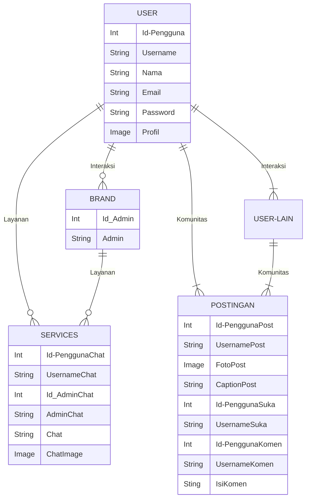
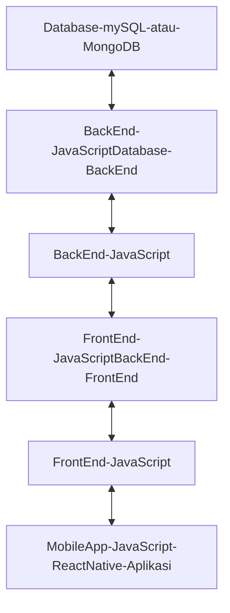
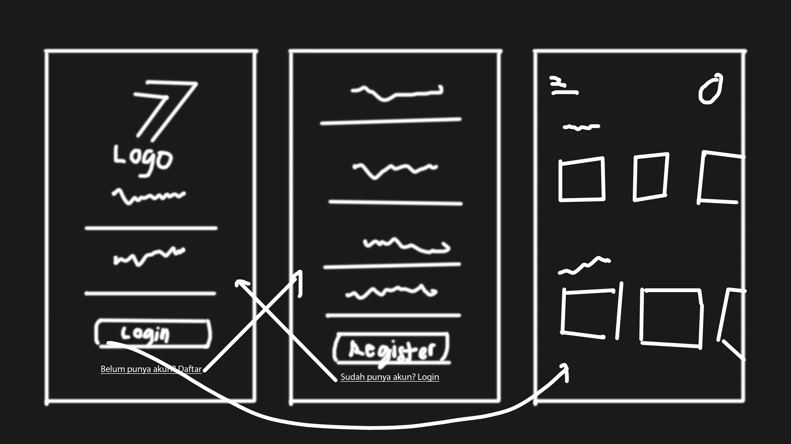

# SEVSPO 

## 1.1 Latar Belakang

Sevspo Indonesia merupakan perusahaan UMKM yang berdiri pada bidang sepatu olahraga. Khususnya pada sepatu futsal dan sepak bola (tersedia juga sepatu running dan sendal). Walaupun hanya UMKM, sudah saatnya untuk meningkatkan kualitas dari segi pelayanan terhadap costumer (end user maupun reseller). Dimana dengan adanya aplikasi ini diharap dapat memudahkan costumer juga memudahkan perusahaan dalam melayani. Aplikasi SEVSPO ini akan menjadi kekuatan untuk brand Sevspo ini sendiri dalam services dan branding.

(Saat ini saya bekerja sebagai editor di Sevspo dan akan mencoba ke bidang lain sesuai pendidikan yang saya jalani seperti saat ini belajar membuat projek aplikasi brand).

## 1.2. Deksripsi Teknologi Informasi

Aplikasi SEVSPO ini dibuat dengan tujuan untuk penguatan dari brand itu sendiri. Tujuan akhir lainnya untuk mempermudah interaksi brand dengan costumer seperti adanya e-commerce sendiri dalam aplikasi, adanya komunitas pengguna yang dapat berbagi momen bersama brand Sevspo, dan bisa menggaet lebih banyak reseller, dsb.

(Sekarang masih menggarap tujuan untuk penguatan brand dimana brand menyiapkan aplikasi untuk mempermudah costumer melihat produk dari Sevspo yaitu seperti catalog).

## 1.3. Branding

- Brand/Merk: SEVSPO  
- Tagline: Maximum Performance  
- Campaign: Bagaimana membuat aplikasi yang akan mempermudah costumer dalam berinteraksi dengan brand maupun dengan costumer lain sebagai bentuk komunitas yang proud memakai brand Sevspo.
- Target user:  
    - Untuk umur 13+.
    - Untuk orang yang memiliki ketertarikan terhadap Sevspo.
    - Untuk user dari brand Sevspo.
    - Untuk orang yang tertarik dengan olahraga.
    - Untuk orang yang suka membagikan momen.
- UI/UX:
  - Branding
  - Mudah digunakan
  - Simpel
  - Warna: Orange dan Putih, sesuai brand

## 2. User Story

| **Sebagai** | **Bisa** | **Untuk** | **Prioritas** |
| --- | --- | --- | ---------- |
| User | Melihat informasi yang dimuat mengenai brand | Mengetahui informasi yang dimuat mengenai brand | ⭐⭐⭐⭐⭐ |  |
| User | Klik informasi yang dimuat mengenai brand | Melihat informasi lengkap yang dimuat mengenai brand | ⭐⭐⭐⭐⭐ |
| User | Mengklik catalog sepatu | Melihat-lihat sepatu | ⭐⭐⭐⭐⭐ |
| User | Mengklik sepatu pilihan | Melihat detail dari sepatu yang dipilih | ⭐⭐⭐⭐|
| User | Mencari sepatu berdasar nama | Mencari sepatu yang diinginkan | ⭐⭐⭐ |
| User | Menambahkan sepatu favorit | Menandai sepatu incaran | ⭐⭐⭐ |
| User | Menambahkan ke keranjang | Memilih dan siap membeli | ⭐⭐ |
| User | Transaksi pembelian | Membeli sepatu | ⭐⭐ |
| User | Chat customer service | Interaksi seputar service | ⭐⭐ |
| User | Mengklaim garansi | Menukar apabila ada kesalahan dan cacat barang | ⭐⭐ |
| User | Melihat fitur komunitas brand | Melihat-lihat postingan komunitas | ⭐⭐ |
| User | Menyukai postingan | Apresiasi komunitas | ⭐⭐ |
| User | Komen postingan | Interaksi antar user | ⭐⭐ |
| User | Membuat postingan | Pamer sepatu sevspo dan mabol | ⭐⭐ |
| User | Membalas komen | Membalas komen dari komunitas | ⭐⭐ |
| User | Mensort sepatu | Memfilter sepatu | ⭐⭐ |
| User | Join reseller  | Menjadi reseller | ⭐⭐ |
## 3. Struktur Data

## 4. Arsitektur Sistem

## 5. Teknologi, Library, dan Framework

- Teknologi yang digunakan:
  - React Native
  - JavaScript
  - React JS
  - Chocolately
  - Yarn
  - JDK
  - Android Studio
  - Emulator android
  - Visual Studio Code
  - mySQL/MongoDB
  - Adobe Photoshop
- Library dan Framework:
  - React Native
  - JavaScript
  - React JS
  - mySQL/MongoDB

## 6. Desain User Experience dan User Interface

## 7. Demonstrasi Video

Link youtube nya

## 8. Bagaimana mesin komputasi dan sistem operasi berperan dalam produk teknologi informasimu ?

Link youtube nya di detik jawaban ini

## 9. Bagaimana algoritma, struktur data, dan bahasa pemrograman berperan dalam produk teknologi informasimu ?

Link youtube nya di detik jawaban ini

## 10. Bagaimana metode pengembangan perangkat lunak / Software Development Life Cycle berperan dalam produk teknologi informasimu ?

Link youtube nya di detik jawaban ini

## 11. Bagaimana database / sistem basis data berperan dalam produk teknologi informasimu ?

Link youtube nya di detik jawaban ini
