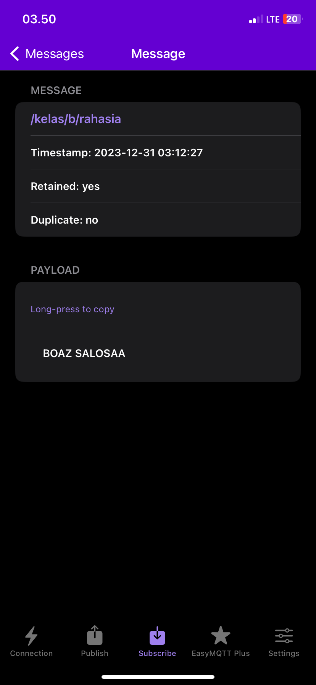

# Hello Informatics ! UAS

## 1.  Menjelaskan dan Menginternalisasi Computational Thinking ⭐⭐⭐⭐⭐⭐⭐
(https://youtu.be/0IFY45Kgnyk)

## 2. Menjelaskan Jenis-Jenis Mesin Komputasi ⭐⭐⭐
(https://youtu.be/0IFY45Kgnyk)

## 3. Mengaktifkan dan Mencoba Google Colab [v] ⭐⭐⭐⭐⭐
(https://youtu.be/0IFY45Kgnyk)

## 4. Mencoba Console Sistem Operasi
(https://youtu.be/0IFY45Kgnyk)
### 4. a) Console di Windows / Mac: Windows CMD [v] ⭐⭐⭐⭐
(https://youtu.be/0IFY45Kgnyk)

### 4. b) Console di Linux: Linux Terminal Menggunakan Google Colab [v] ⭐⭐⭐⭐
(https://youtu.be/0IFY45Kgnyk)

## 5. Membuat Algoritma Dalam Bentuk Flow Chart [v] ⭐⭐⭐⭐⭐
(https://youtu.be/0IFY45Kgnyk)

## 6. Mencoba Scratch Bahasa Indonesia [v] ⭐⭐⭐⭐⭐⭐⭐
(https://youtu.be/0IFY45Kgnyk)

## 7. Mencoba Algoritma Bubble Sort Menggunakan Java [v] ⭐⭐⭐
(https://youtu.be/0IFY45Kgnyk)

## 8. Mencoba dan Mendemonstrasikan Penggunakan IDE ⭐⭐
(https://youtu.be/0IFY45Kgnyk)

## 9. Mendaftar, Mengeksplorasi, dan Mendemonstrasikan Penggunaan HackerRank [v] ⭐⭐⭐⭐⭐
(https://youtu.be/0IFY45Kgnyk)

## 10. Mendemonstrasikan Pembuatan Aplikasi / Game Pada Platform : Mobile / Desktop / Web Browser ⭐⭐⭐⭐⭐
(https://youtu.be/mc_MWisHQ_E)

## 11. Mencoba Instalasi Database (PostgreSQL / MySQL / dsb.) [v] ⭐⭐⭐
(https://youtu.be/0IFY45Kgnyk)

## 12. Mencoba Eksplorasi dan Query Database Menggunakan Database Explorer (Dbeaver / dsb.) [v] ⭐⭐⭐
Koneksi berhasil PostgreSQL-1.png>)
Koneksi berhasil DBeaver ke PostgreSQL-1.png>)
Membuat tabel dan data di querry DBeaver.png>) 
Hasil di DBeaver.png>)
hasil di SQL Shell.png>) 
Membuat tabel di SQL Shell.png>)


## 13. Mendemonstrasikan dan Menjelaskan Penggunaan Web Browser untuk Mengakses Halaman Website HTML [v] ⭐⭐⭐⭐
- Masukkan Alamat Web : Buka browser dan masukkan alamat web yang ingin Anda kunjungi.
- Permintaan ke Server : Browser mengirimkan pesan ke server web untuk meminta halaman web.
- Terima Halaman Web : Server mengirimkan halaman web (HTML, CSS, gambar, dll.) kembali ke browser.
- Download dan Tampilkan : Browser mengunduh dan menampilkan semua bagian halaman web.
- Interaksi Pengguna : Anda dapat mengklik tautan, mengisi formulir, atau berinteraksi dengan halaman.
- Selesai dan Ditutup: Jika sudah selesai, Anda dapat menutup browser.

(https://youtu.be/Cc6CLZxdT4M)
## 14. Mendemonstrasikan dan Menjelaskan Komponen Dari Contoh Uniform Resource Locator (URL) [v] ⭐⭐
Dalam konteks URL, istilah "resource" merujuk pada sesuatu yang dapat diakses atau ditemukan di internet. Resource bisa berupa berbagai jenis informasi atau objek, seperti halaman web, dokumen teks, gambar, file audio, video, aplikasi, atau sumber daya lainnya yang dapat diakses melalui jaringan. 

Sebagai contoh saya menggunakan wikipedia tentang teknologi informasi :

https://id.wikipedia.org/wiki/Teknologi_informasi#/media/Berkas:2005ICT.PNG

- Skema (Scheme): https://
- Alamat Host: id.wikipedia.org
- Path: /wiki/Teknologi_informasi
- Fragment Identifier: #/media/Berkas:2005ICT.PNG

Source di alamat web wikipedia ini yang paling mendekati berada di path, dimana untuk menunjukkan halaman web.
Jadi, letak source selalu berbeda tergantung dari konteks alamat web-nya.


## 15. Mencoba Pelacakan Informasi Server dari Alamat Domain [v] ⭐
who.is 

Whois adalah layanan yang menyediakan informasi tentang kepemilikan domain internet, seperti nama pemilik, informasi kontak, registrar domain, tanggal pendaftaran, dan informasi teknis lainnya terkait domain. Layanan ini memungkinkan pengguna untuk mengetahui siapa yang memiliki atau mengelola suatu domain internet.

.png>)
.png>)
NsLookup.io 

Begitupun juga seperti whois, ini berhubungan dengan Domain Name System DNS, layanan yang menyediakan informasi tentang kepemilikan domain internet, seperti nama pemilik, informasi kontak, registrar domain, tanggal pendaftaran, dan informasi teknis lainnya terkait domain. Layanan ini memungkinkan pengguna untuk mengetahui siapa yang memiliki atau mengelola suatu domain internet.

.png>) 
.png>)


## 16. Mencoba Pembuatan Halaman Web Menggunakan HTML, CSS, dan JavaScript [v] ⭐⭐⭐
Menggunakan HTML, CSS, JS.
.png>)
Memakai bootsrap carousel
.png>)
.png>)
JS interaktif.
.png>)
CSS hover.
.png>)
.png>)

## 17. Mencoba Penerapan Teknik Search Engine Optimization (SEO) Pada HTML [v] ⭐⭐⭐

Studi kasus : WordPress

WordPress.png>)

Dan diatas adalah wordpress dari saya dimana itu adalah tugas sekelas untuk membuat program penerapan SEO ini berjalan. Yang dimana setiap orang membuat tema, judul, dan konsep blog wordpress yang sama atau saling berkaitan satu sama lain. Yang dimana jika hal ini berhasil maka Search Engine Optimization atau SEO akan berhasil diterapkan.

Dimana kasus ini menggunakan off page atau yang bisa kita harapkan dilakukan pihak lain terhadap kita.

Tetapi tentu juga on page diterapkan dalam pembuatan wordpress blog masing-masing.

## 18. Mencoba Pembuatan File JSON [v] ⭐⭐⭐
```json
{

    "nama_data": "List Sepatu Ready",
    "isi_data": [
        {
            "name": "Maestro Leather",
            "color": "White Blue Red",
            "price": 599000,
            "image": "1_0043_Layer-1.png"
        },
        {
            "name": "Maestro Leather",
            "color": "White Black Red",
            "price": 599000,
            "image": "1_0009_2.png"
        },
        {
            "name": "Maestro Leather",
            "color": "White Blue Red",
            "price": 599000,
            "image": "1_0010_3.png"
        },
        {
            "name": "X-ZORO Leather",
            "color": "Black Red",
            "price": 699000,
            "image": "1_0011_4.png"
        },
        {
            "name": "GARUDA SYN",
            "color": "White Blue Red",
            "price": 549000,
            "image": "1_0012_5.png"
        },
        {
            "name": "GARUDA SYN",
            "color": "Black Yellow Red",
            "price": 549000,
            "image": "1_0013_6.png"
        },
        {
            "name": "GARUDA SYN",
            "color": "White Green Blue",
            "price": 549000,
            "image": "1_0014_7.png"
        },
        {
            "name": "GARUDA SYN",
            "color": "Red Black White",
            "price": 549000,
            "image": "1_0015_8.png"
        }
    ]
 }
```


## 19. Mencoba Penggunaan Web Hosting Dengan Untuk Halaman HTML [v] ⭐⭐⭐
.png>) .png>) .png>) .png>) .png>)

## 20. Mencoba Penggunaan Web Hosting Dengan Untuk Web Service [v] ⭐⭐⭐
.png>) .png>) .png>) .png>) .png>)

## 21. Mencoba HTTP Request dan Web API dengan HTTP Client Hoppscotch / Postman [v] ⭐⭐
.png>)  .png>) .png>)


## 21. Mendemonstrasikan Penggunaan Developer Tools Pada Web Browser (Firefox / Chrome) [v] ⭐⭐⭐⭐⭐
(https://youtu.be/Cc6CLZxdT4M)

## 21. Mengeksplorasi dan Menjelaskan Layanan Cloud Service yang Diminati (GCP / AWS / Azure) [v] ⭐⭐
Saya pribadi lebih untuk memilih GCP yang dimana AWS dan Azure sangat bertele-tele tentang harga tidak secara langsung dan lugas bahkan sangat sulit untuk menemukannya. Tapi untuk Azure terdapat harga hanya saja banyak untuk produknya dan memerlukan pertimbangan dan tidak langsung tertera untuk harga aslinya. Dan untuk GCP di halaman awal harga langsung tertera dan dapat informasi dengan mudah.

.png>) .png>) .png>)

## 22. Mencoba Penggunaan Content Management System (Wordpress) [v] ⭐⭐⭐
WordPress.png>)

## 23. Mendemonstrasikan Akses Konten Multimedia (Image, Audio, Video) ⭐⭐⭐
(https://youtu.be/Cc6CLZxdT4M)
## 24. Mencoba Edit Konten Multimedia (Image, Audio, Video) [v] ⭐⭐
.png>) .png>)

Baru download dan juga baru mencoba GIMP sama Inkscape
- GIMP masih terasa susah karena terbiasa pakai photoshop yang overpower untuk manipulasi
- Inkscape terasa lebih menyenangkan daripada corel dan illustrator

## 25. Mencoba Pembuatan Game dan Simulasi Menggunakan Logo [v] ⭐⭐
(https://youtu.be/Cc6CLZxdT4M)

## 26. Mencoba Pemrosesan Konten Multimedia (Image, Audio) Menggunakan Google Colab [v] ⭐⭐⭐
.png>) .png>) .png>) .png>) .png>) .png>)


## 27. Mencoba Web Tool AI Discriminative (Image Classification) [v] ⭐⭐⭐⭐
(https://youtu.be/EIvNKk2eu-w)

## 28. Mencoba Web Tool AI Generative (Text to Image, Text to Text) [v] ⭐⭐⭐⭐
(https://youtu.be/EIvNKk2eu-w)

## 29. Mencoba Model Machine Learning Menggunakan Google Colab, TTS, Speechrecognition, dan HuggingFace [v] ⭐⭐⭐
(https://youtu.be/EIvNKk2eu-w)

## 30. Mencoba Data Visualization Dengan Tools [v] ⭐⭐
.png>) .png>)

## 31.  Mencoba Data Visualization Dengan Code [v] ⭐⭐
.png>)

## 32. Mendaftar dan Mencoba Eksplorasi HuggingFace [v] ⭐⭐⭐
.png>) .png>) .png>) .png>)

.png>) .png>)

Menjawab pertanyaan gambar bawaan benar dengan 2 kucing, tetapi saat saya modifikasi menjadi yang menghitung tangan terdapat kesalahan perhitungan.
## 33. Mendaftar dan Mencoba Eksplorasi Kaggle [v] ⭐⭐⭐⭐
.png>) .png>)


## 34. Mencoba Protokol Komunikasi IoT (MQTT) [v] ⭐


## 35. Mencoba Memproses File CSV Menggunakan Google Colab [v] ⭐⭐
.png>)

## 36. Mencoba Memproses File Big Data ORC Menggunakan Google Colab [v] ⭐⭐
.png>) .png>) .png>) .png>)

## 37. Menjelaskan Jurnal, Conference, Artikel, Grade Jurnal [v] ⭐⭐⭐⭐⭐
(https://youtu.be/oOdTDoi8_gI)
## 38. Eksplorasi Artikel Jurnal / Conference di Repository Terekognisi Internasional (IEEE / Arxiv / Science Direct / ACM /DBLP) [v] ⭐⭐⭐⭐
(https://youtu.be/oOdTDoi8_gI)

## 39. Menonton Video Presentasi Tugas Akhir Informatika ⭐⭐⭐⭐⭐
(https://youtu.be/oOdTDoi8_gI)

## 40. Mengeksplorasi Seluruh Profesi Terkait Informatika dan Profesi yang Diminati ⭐⭐⭐⭐
(https://youtu.be/Etc6eUAaufg)
## 42. Eksplorasi Tools Untuk Belajar Bahasa Inggris (Duolingo) ⭐⭐⭐
(https://youtu.be/Etc6eUAaufg)
## 43. Eksplorasi Tools Untuk Belajar Berbicara Bahasa Inggris (HelloTalk) ⭐⭐⭐ 
(https://youtu.be/Etc6eUAaufg)
## 44. Eksplorasi Lowongan Pekerjaan IT ⭐⭐⭐
(https://youtu.be/Etc6eUAaufg)
## 45. Eksplorasi Lowongan Freelancer IT (Upwork / Toptal / Freelancer.com) ⭐⭐⭐
.png>) .png>) .png>)
Untuk Toptal tidak bisa login memakai google jadi sedikit hilang minat, dan untuk freelancer.com terkendala pada saat awal untuk pemilihan payment tidak memiliki kartu kredit atau debit visa mastercard, dan untuk memakai PayPal pun terkendala.
## 46. Eksplorasi dan Pilih Topik yang Diminati di Roadmap.sh ⭐⭐⭐
https://roadmap.sh/cyber-security

Tetapi masih banyak lagi yang diminati dan disukai, tetapi untuk CyberSecurity ini membuat saya lebih minat dan penasaran.

## 47. Eksplorasi Top Github Project yang Diminati ⭐⭐ 
https://github.com/freeCodeCamp/freeCodeCamp
https://github.com/EbookFoundation/free-programming-books
https://github.com/kamranahmedse/developer-roadmap
## 48. Membangun Profil Linkedin dan Mengikuti Akun-Akun Inspirasif Bertema Informatika ⭐⭐⭐
.png>) .png>) .png>)
## 49. Membangun Profil Github Page ⭐⭐⭐⭐⭐
.png>)
Semoga skill-skill IT-nya menjadi do'a dan motivasi dan terus bertambah🙏
## 50. Mengikuti Workshop / Event / Course Terkait IT ⭐⭐⭐⭐
.png>) .png>)
## 51. Membaca dan Mengambil Inspirasi Dari Buku Bertema Informatika ⭐⭐⭐⭐⭐
Buku Komputer & Masyarakat

Buku ini tidak sekadar menyentuh permukaan antara pengguna dan alat saja, tetapi merangkul saya dalam memahami hubungan antara komputer dan kehidupan masyarakat secara menyeluruh di setiap bidang. Terima kasih karena membuat saya sadar akan keajaiban dan tanggung jawab yang melekat dalam era digital ini.
